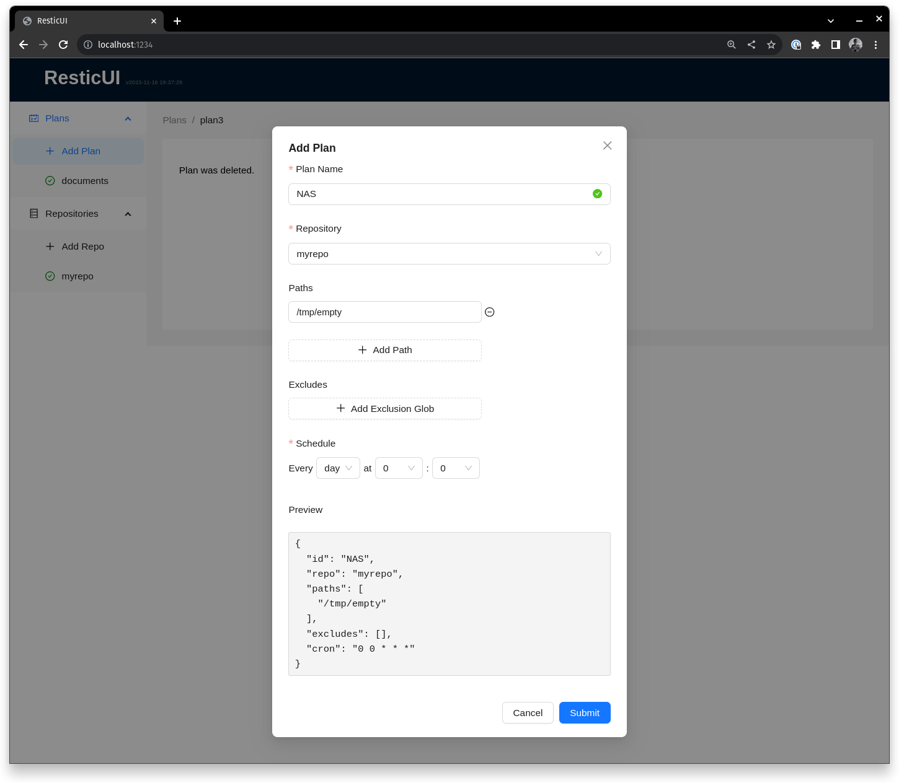
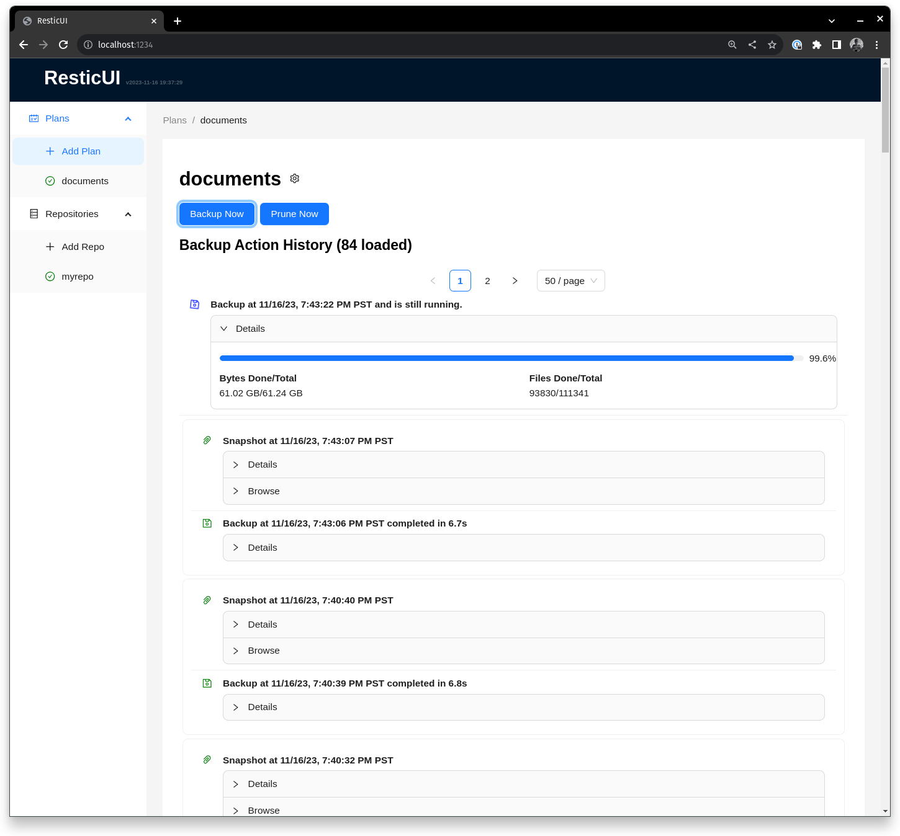
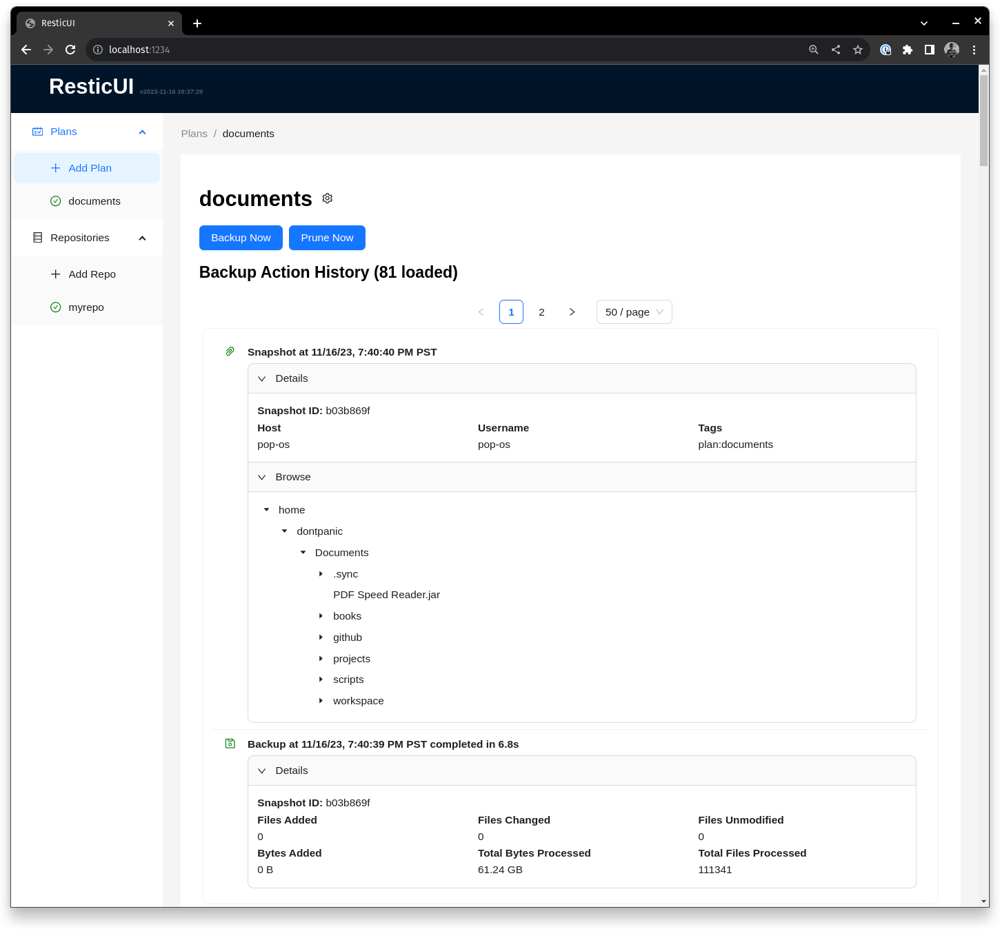

# ResticUI

[](https://github.com/garethgeorge/resticui/actions/workflows/build-and-test.yml)

ResticUI is a WebUI wrapper for [restic](https://restic.net/). It is intended to be used as a self-hosted application for managing backups of your data.

The goals of the project are:

 * Single binary deployment: the UI and backend are bundled into a single binary that can be deployed with no dependencies (other than restic!).
 * Light weight: the binary weighs in at ~25 MB as of writing and the goal is to keep it in this territory. 
 * Easy to pull back the curtain: the UI is intended to be a wrapper around restic, but does not preclude using restic commands directly. It's easy to list snapshots directly using restic as a CLI to understand what's being stored.
 * Performant
   * Low background memory use
   * Snapy UI performant leveraging [bbolt](https://github.com/etcd-io/bbolt) as a state store and cache.

Feature Support

 * [x] Configure multiple restic repositories
 * [x] Configure multiple backup plans for each repository
 * [x] Execute scheduled backup operations e.g. on a cron schedule
* [x] Execute manually triggered backup operations
* [x] Browse backup operation history
* [x] Browse snapshot history
* [x] Browse files in a snapshot
* [ ] Restore files from a snapshot (use restic UI to identify a snapshot to restore, use restic cli to restore it today)
* [ ] Prune snapshots after backup operations (recommend periodically running `restic prune` on the CLI until this feature is supported)

# Getting Started 

## Running 

Installation options

 * Download a release from the [releases page](https://github.com/garethgeorge/resticui/releases), extract and run the binary (you may need to mark it executable e.g. `chmod +x resticui`).
 * Build from source ([see below](#building)).

ResticUI is accessible from a web browser. By default it binds to `0.0.0.0:9898` and can be accessed at `http://localhost:9898`. 

# Configuration

**Environment Variables**

 * RESTICUI_PORT - the port to bind to. Defaults to 9898.

**Configuration File**

ResticUI uses a JSON config. The default config location is `$HOME/.config/resticui/config.json` or if `$XDG_CONFIG_HOME` is set, `$XDG_CONFIG_HOME/resticui/config.json`. 


## Screenshots

Configuring a backup plan:


Running backup operation:


Browsing snapshots:


# Developer Setup

## Dev Depedencies

**Build Dependencies**

 * Node.JS for UI development
 * Go 1.21 or greater for server development
 * go.rice `go install github.com/GeertJohan/go.rice@latest` and `go install github.com/GeertJohan/go.rice/rice@latest`

**To Edit Protobuffers**
```sh
apt install -y protobuf-compiler
go install \
    github.com/grpc-ecosystem/grpc-gateway/v2/protoc-gen-grpc-gateway@latest \
    github.com/grpc-ecosystem/grpc-gateway/v2/protoc-gen-openapiv2@latest
go install github.com/grpc-ecosystem/protoc-gen-grpc-gateway-ts@latest
go install google.golang.org/protobuf/cmd/protoc-gen-go@latest
go install google.golang.org/grpc/cmd/protoc-gen-go-grpc@latest
go install github.com/bufbuild/buf/cmd/buf@v1.27.2
```
## Building

```sh
(cd webui && npm i && npm run build)
(cd cmd/resticui && go build .)
```
